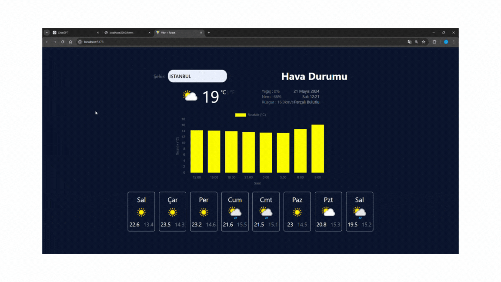

# Hava Durumu Uygulaması Hakkında

Bu proje, kullanıcıların belirli bir şehir adı girerek üç günlük hava tahmini raporlarını almasını sağlayan basit bir hava durumu uygulamasıdır. Uygulama, weatherapi, axios, tailwindcss ve cartjs2 kütüphanelerini kullanarak geliştirilmiştir.

# Özellikler

- Kullanıcılar, bir şehir adı girerek o şehrin üç günlük hava tahminini görebilirler.
- Hava durumu bilgileri weatherapi kullanılarak elde edilir.
- Uygulamanın arayüzü tailwindcss kullanılarak oluşturulmuştur.
- Hava durumu tahminleri grafiksel olarak cartjs2 ile gösterilir.

# Kütüphaneler

- weatherapi
- axios
- tailwindcss
- cartjs2

